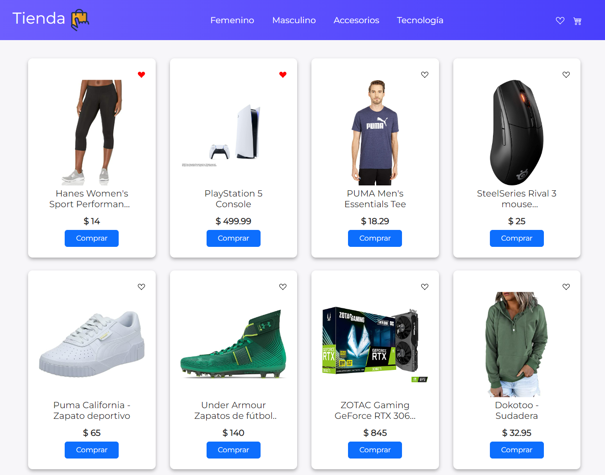
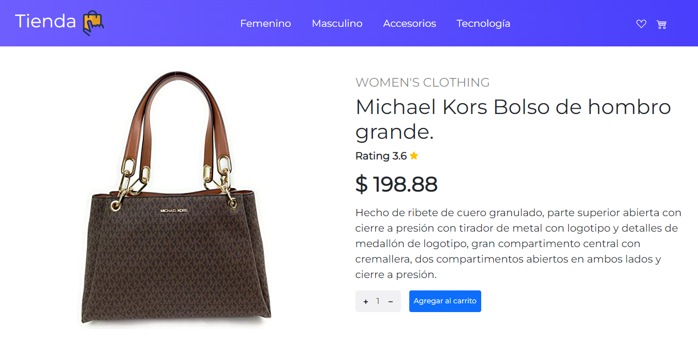
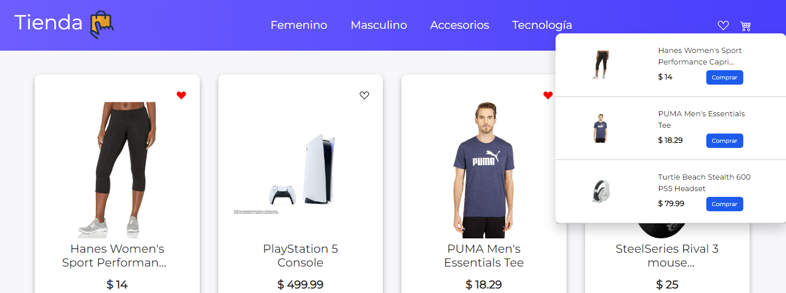
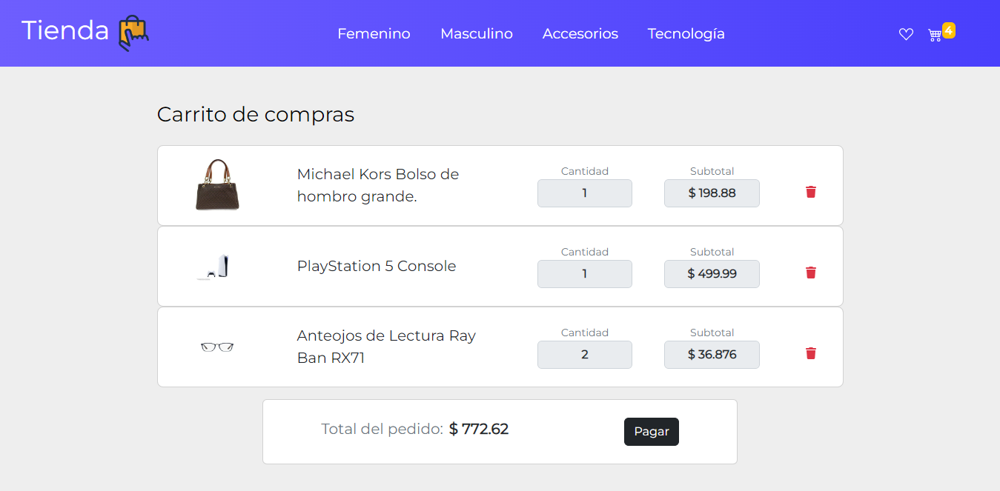

# **Proyecto Ecommerce React** 
# *Curso de React dictado por Coderhouse*
### **Desarrollado por Tomás Banchio**
### **Contacto:**

# *Info:*

Este es el proyecto final del curso dictado por [CoderHouse](https://www.coderhouse.com) de React Js de la carrera Front-End.
Se trata de un Ecommerce, construido sobre React, que implementa React Router, React Hooks, Bootstrap (tanto común como React Bootstrap), React-Icons, React-Spinners y Firebase. Contiene un filtro por categoría, almacenamiento de favoritos y un carrito de compras para registrar el pedido.

## *Version Final:*
Link del proyecto: 
- 

 

### 1. Home:
## 

### 2. Detalle del producto seleccionado:

## 

### 3. Sección para ver favoritos:

## 

### 3. Carrito de compras, con productos seleccionados:

## 

### 4. Formulario para realizar la compra:

## 
### 5. Compra finalizada con éxito:

